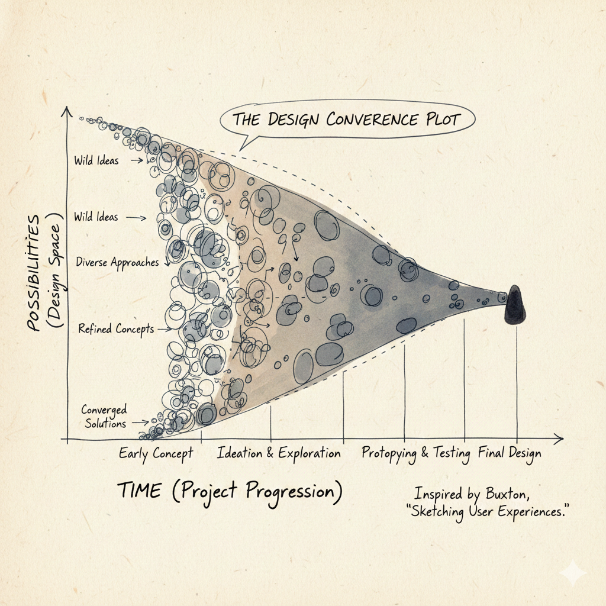
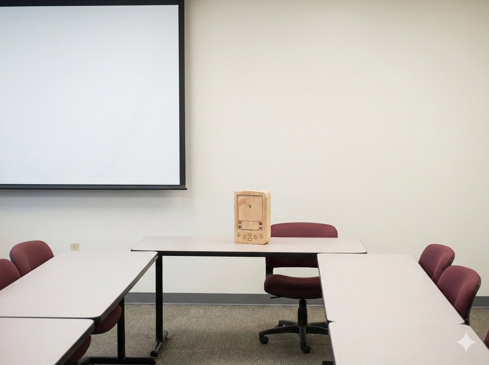
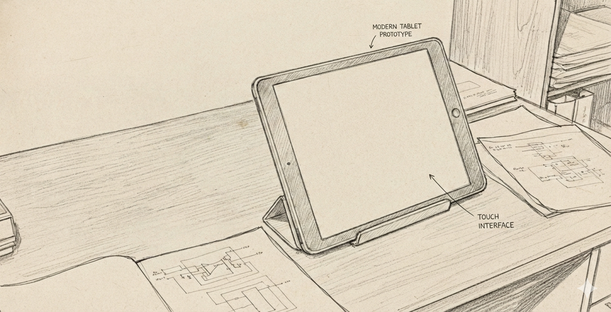

# HCI principles and universal accessibility

Human-Computer Interaction (HCI) is a multidisciplinary field focused on the design and use of computer technology, particularly the interfaces between people (users) and computers. The goal of HCI is to create systems that are efficient, effective, and satisfying for users.

## Key Principles of HCI

1. **User-Centered Design**: Designing systems with the needs, preferences, and limitations of end-users in mind.

2. **Consistency**: Ensuring that similar operations and elements behave in similar ways across the system to reduce the learning curve.

3. **Feedback**: Providing users with clear and immediate feedback on their actions to help them understand the results of their interactions.

4. **Affordance**: Designing elements in a way that suggests their functionality (e.g., buttons should look clickable).

5. **Error Prevention and Recovery**: Designing systems to minimize the chances of user errors and providing easy ways to recover from them.

6. **Flexibility and Efficiency of Use**: Allowing users to customize their interactions and providing shortcuts for experienced users.

7. **Aesthetic and Minimalist Design**: Keeping interfaces clean and uncluttered to avoid overwhelming users with unnecessary information.


## Universal Accessibility

Universal accessibility refers to the design of products, devices, services, or environments for people with disabilities. The goal is to ensure that everyone, regardless of their abilities or disabilities, can access and use technology effectively.

### Principles of Universal Accessibility

1. **Perceivable**: Information and user interface components must be presented in ways that users can perceive, regardless of their sensory abilities (e.g., providing text alternatives for images).

2. **Operable**: User interface components and navigation must be operable by all users, including those with motor impairments (e.g., ensuring that all functionality is available from a keyboard).

3. **Understandable**: Information and the operation of the user interface must be understandable to all users (e.g., using clear and simple language).

4. **Robust**: Content must be robust enough to be interpreted reliably by a wide variety of user agents, including assistive technologies (e.g., ensuring compatibility with screen readers).

### Best Practices for Universal Accessibility

- Use semantic HTML to ensure that content is structured logically.
- Provide alternative text for images and multimedia content.
- Ensure sufficient color contrast between text and background.
- Design for keyboard navigation and avoid relying solely on mouse interactions.
- Test interfaces with assistive technologies such as screen readers.

## UX design

- User Experience (UX) design focuses on enhancing user satisfaction by improving the usability, accessibility, and pleasure provided in the interaction between the user and the product. 

- Good UX design considers the entire user journey, from initial contact to final interaction.


## Interaction Design

- Interaction design is a subset of UX design that focuses specifically on the design of interactive digital products and services. It involves creating engaging interfaces with well-thought-out behaviors.


## Wireframing and Prototyping
- Wireframing is the process of creating a visual guide that represents the skeletal framework of a digital product. It helps in planning the layout and functionality before detailed design and development.
- Prototyping involves creating an early model of a product to test and validate design concepts and user interactions.
- 💡 Use _Miro_ or _Figma_ for wireframing and prototyping.


## Information Architecture

- Information architecture (IA) is the practice of organizing and structuring content in a way that makes it easy for users to find and navigate information.
- Good IA enhances usability and helps users understand where they are within a digital product.

## Sitemaps and Navigation Design

- Sitemaps are visual representations of the structure of a website or application, showing the relationships between different pages and sections.
- Navigation design focuses on creating intuitive and efficient ways for users to move through a digital product.
- [Draw.io](https://app.diagrams.net/) can be used to create sitemaps and navigation flows.
- [digestwebdesign.com article on IA](https://digestwebdesign.com/information-architecture/)


## Storyboarding

- Storyboarding is a technique used to visualize the user journey and interactions with a product through a series of illustrations or images.
- It helps designers understand user needs and behaviors, and plan the overall experience.
- Sample tool: [Canva Storyboard Maker](https://www.canva.com/create/storyboards/)


## Design Patterns

- Design patterns are reusable solutions to common design problems. They provide a standard way of solving specific design challenges and can improve consistency across a product.
- Examples include navigation menus, search bars, and form layouts. 
- [UI Patterns](https://ui-patterns.com/): A collection of design patterns for user interfaces.


## Accessibility

- Resources
    - [W3C Web Accessibility Initiative (WAI)](https://www.w3.org/WAI/): Comprehensive resources and guidelines for web accessibility.
    - [A11y Project](https://www.a11yproject.com/): A community-driven effort to make web accessibility easier.
    
## The elements of user experience

- 📚 📝 [The User Experience](http://www.jjg.net/elements/pdf/elements_ch02.pdf
): A detailed look at the components of user experience design.

- 🚀 _Concept_ The elements of user experience framework, developed by Jesse James Garrett, outlines five key planes of user experience design: Strategy, Scope, Structure, Skeleton, and Surface.
- [The User Experience](http://www.jjg.net/elements/pdf/elements_ch02.pdf
): A detailed look at the components of user experience design.
- This framework helps designers understand the different aspects of user experience and how they interrelate.

- Each plane builds upon the previous one, starting with the overall strategy and moving down to the visual design of the interface.
- Plan your project so that work on each plane is completed before moving to the next.

- 🤔 When the Web started, there were two groups of people: one saw Web pages as documents (and applied principles from traditional media such as publishing), the other saw them as applications (and applied principles from desktop applications). 

- Today, most Web sites are a mixture of both.


## Duality of Web as document and application
- Web as Document: Focuses on delivering _content_, such as articles, images, and videos. The primary goal is to inform or entertain the user.
- Web as Application: Emphasizes _tasks_: interactivity and functionality, allowing users to perform tasks such as filling out forms, making purchases, or using web-based software.
- Designers must balance these two aspects to create effective and engaging web experiences.

## Human centered design

- Human-Centered Design (HCD) is an approach to problem-solving that prioritizes the needs, preferences, and limitations of end-users throughout the design process.
- HCD involves understanding users through research, involving them in the design process, and iteratively testing and refining solutions based on user feedback.
- The goal of HCD is to create products and services that are not only functional but also enjoyable and accessible for the people who use them.

## Design thinking

- Design Thinking is a problem-solving approach that emphasizes empathy, creativity, and iterative testing. It involves five key stages: Empathize, Define, Ideate, Prototype, and Test.
- Design Thinking encourages designers to deeply understand user needs, generate a wide range of ideas, and create prototypes to test and refine solutions.
- This approach fosters innovation and helps create user-centered products and services.

## User experience design process

1. **Research**: Understand the users, their needs, and the context of use through methods such as interviews, surveys, and observations.
2. **Define**: Synthesize research findings to define user personas, scenarios, and requirements.
3. **Ideate**: Generate a wide range of ideas and potential solutions through brainstorming and other creative techniques.
4. **Prototype**: Create low-fidelity and high-fidelity prototypes to visualize and test design concepts.
5. **Test**: Conduct usability testing with real users to gather feedback and identify areas for improvement.
6. **Implement**: Work with developers to bring the design to life, ensuring that the final product meets user needs and design specifications.
7. **Evaluate**: Continuously assess the user experience post-launch and make iterative improvements based on user feedback and analytics.

A diagram of the process can be found [here](https://www.interaction-design.org/literature/article/the-7-steps-of-the-user-experience-design-process).


## Usability 101 by Jakob Nielsen

📝 [See PDF here, page 15](https://hci-lecture.de/HCI/topics/intro/02-TermiBasics/termiBasics20200413.pdf)

- Jakob Nielsen, a renowned usability expert, has outlined ten key principles for designing usable interfaces:
1. **Visibility of system status**: Keep users informed about what is going on through appropriate feedback within a reasonable time.
2. **Match between system and the real world**: Use language and concepts familiar to users, following real-world conventions.
3. **User control and freedom**: Provide users with the ability to undo and redo actions easily.
4. **Consistency and standards**: Follow platform conventions and maintain consistency throughout the interface.
5. **Error prevention**: Design systems to prevent errors from occurring in the first place.
6. **Recognition rather than recall**: Minimize the user's memory load by making objects, actions, and options visible.
7. **Flexibility and efficiency of use**: Allow users to tailor frequent actions and provide shortcuts for experienced users.
8. **Aesthetic and minimalist design**: Avoid unnecessary information and focus on essential elements.
9. **Help users recognize, diagnose, and recover from errors**: Use clear error messages and provide constructive solutions.
10. **Help and documentation**: Provide easily accessible help and documentation when needed.

- A diagram summarizing these is shown [here](https://www.nngroup.com/articles/ten-usability-heuristics/)


## Prototyping (A powerful tool for HCI)

- 🧩 🚀[Video on HCI prototyping Stanford](https://www.youtube.com/watch?v=IyMT91wUO54&list=PLLssT5z_DsK_nusHL_Mjt87THSTlgrsyJ&index=2)

- Protyotyping grounds communication.

- Communicating to stakeholders.

- 🧩🚀 _Concept_ Serves as a _common ground_.

- 🤔❓ Example: Kodak built a quick prototype to show what a digital camera can do.

- It is incomplete. It is like a sketch.

- _Buxton_ Sketching User Experiences book.

- The number of possibilities narrows as time goes on. This is shown in the figure below:



- In the 1990s Jeff Hawkins was prototyping the _Palm Pilot_. He built a wooden prototype to test the size and shape of the device (form factor).



- 🧩🚀 _Concept_ Try lots of different ideas quickly.

- Cost of change increases as time goes on.

- Biggest changes should be made early.


## 🎮🛠️ Activity (power of prototypes)

- 🎮🛠️ Listen to this great [TEDx talk by Scott Klemmer](https://youtu.be/KY_W1JgX6YA?si=TjndKSC9skJAa4kJ)

- _Never go to a meeting without a prototype_ 

- 🧩🚀 Prototypes are like _postcards from the future_


## Usability studies

- [Video lecture from Stanford](https://youtu.be/ar9Jzl3r0gc?si=DVYYTC2US2TKFxSc)

- How are users going to use the system?

- Usability studies involve observing and analyzing how real users interact with a product or system to identify usability issues and areas for improvement.

- Alan Kay prototyped the [_Dynabook_](https://en.wikipedia.org/wiki/Dynabook#/media/File:Dynabook.png) concept in the 1970s. He built a physical model to demonstrate the idea of a portable computer for learning.




## 📚📝 Software

- [Figma](https://www.figma.com/): A collaborative interface design tool for creating wireframes, prototypes, and design systems.
- [Miro](https://miro.com/): An online collaborative whiteboard platform for brainstorming, wireframing, and planning.
- [Canva Storyboard Maker](https://www.canva.com/create/storyboards/): A tool for creating storyboards to visualize user journeys and interactions.


## Birth of HCI

- [Video by Scott Klemmer on the history of HCI](https://youtu.be/ar9Jzl3r0gc?si=MQeX1s4pSZzA132X)

- [TEDx talk by Scott Klemmer](https://youtu.be/KY_W1JgX6YA?si=TjndKSC9skJAa4kJ)

- Field started with Vannevar Bush's 1945 article ["As We May Think"](https://en.wikipedia.org/wiki/As_We_May_Think) in _The Atlantic Monthly_.

- 🤔❓[`Memex`](https://en.wikipedia.org/wiki/Memex) concept: a personal device to store and retrieve information using associative links. All the world's knowledge stored and accessed easily. Remind you of something? 

- 🧩🚀 _Concept_ You could use `machines` to extend the power of the human mind.

- Analog device designed to serve as a mechanized extension of human memory.

- Desk-like workstation equipped with translucent screens and microfilm storage. The device was intended to house a user's entire personal library of books, records, and communications, providing a solution to the "information explosion" of the post-war era by making vast amounts of data instantly retrievable.

- The true breakthrough of the Memex was the concept of associative indexing, which served as the conceptual blueprint for the modern hyperlink. Bush realized that the human mind operates by association rather than by rigid, alphabetical, or numerical filing. The Memex would allow a user to create "trails" of related information, permanently linking two items together so that pulling up one would automatically lead to the other. By mirroring the nonlinear nature of human thought, the Memex aimed to transform a static archive into a dynamic, personalized web of knowledge.


- This motivated the birth of the World Wide Web.

- _Graphical User Interface_ (GUI) invented at Xerox PARC in the 1970s.

- Ivan Sutherland's 1963 _Sketchpad_ system was an early pioneering computer program that introduced the concept of graphical user interfaces (GUIs) and interactive computer graphics. It allowed users to create and manipulate graphical objects directly on a computer screen using a light pen, laying the groundwork for interactive computing.

- Followed by Douglas Engelbart's 1962 report "Augmenting Human Intellect: A Conceptual Framework". He demonstrated the _oN-Line System_ (NLS) in 1968, which featured hypertext linking, video conferencing, and a mouse-driven cursor.

- Alan Kay at Xerox PARC envisioned the _Dynabook_ in the 1970s, a portable, personal computer for learning and creativity, which laid the conceptual foundation for modern laptops and tablets.

- It is the 1980s. It is now 40 years since Vannavar Bush's article. 

- `The Long Nose of Innovation` by Buxton.

- The power of prototypes.


## Participant observation

[Video lecture on participant observation](https://youtu.be/8SnFEINtf4U?si=SUBO3sTVmvc71-Vj)

- "You can observe a lot by watching" - Yogi Berra

- App for truck drivers needs to have big icons and buttons, and stylus since they will be wearing gloves.

- Deep hanging out

- Be a good apprentice

- Look around for workarounds. For example, post-it notes on printers reminding people how to use it. That could be an opportunity for improving the device.

- Anthropologists/ethnographers studying how people used fax machine at Xerox PARC. We assume that if people cannot use a technology, they are "dumb". However maybe the technology has been designed well enough.

- Walmart asked users in a survey if they would like the aisle to be less cluttered? Please note that they did not ask how the users _used_ the facilities and asked them a leading question. This actually let them to declutter the aisles and eventually led to decline in sales!


## Experience economy

- [pg 14 PDF here](https://hci-lecture.de/HCI/topics/intro/03-TermiUX/TermiUX20200413.pdf)

- Pine, B. Joseph, and James H. Gilmore. "Welcome to the experience economy." Harvard business review 76 (1998): 97-105.https://hbr.org/1998/07/welcome-to-the-experience-economy

- The _experience economy_ is a concept that suggests businesses should focus on creating memorable experiences for customers rather than just providing goods or services.

- Previously , economies evolved from agrarian to industrial to service-based. The next stage is the experience economy, where the focus is on engaging customers through unique and personalized experiences.

- In the context of HCI and UX design, this means designing digital products and services that engage users on an emotional level, creating positive and lasting impressions.

- By prioritizing user experience and emotional engagement, businesses can differentiate themselves in a competitive market and build stronger relationships with their customers.


## Interviewing participants

- What makes something interesting? Anything can be interesting. Even a washing machine.

- Talk with the right people. Not the top echelons. But the people in the middle. (`Malcom Gladwell`)

- Do not ask leading questions : _Would you like a daily update?_

- Sometimes users do not know what they want. Heny Ford had said: `If you asked users in 1800s what they wanted, they would have said a faster horse`.

- Concept: 🧩🚀 _The designer knows the possibilities, but the user does not_

- Instead ask users about their daily lives

- Ask good questions (open ended questions)

_  _Silence is golden_. Listen to the users and give them time to reflect and respond.


## Interview techniques

- Diaries. Keep interviewees diaries which they write.

- Followup. Remind people.

- Meet people regularly.

- Lead users. Designers help lead users come up with good solutions. Doctors come up with innovative solutions.

- [Democratizing Innovation and Lead users by Eric von Hippel](https://web.mit.edu/evhippel/www/books/DI/DemocInn.pdf)

- Create _personas_ of users. Models of different kinds of users.


## Creating design goals

[Lecture by Scott Klemmer](https://youtu.be/m92DLyQNoS8?si=Gim1LN2dTgyVHcim)

- Design transforms existing solutions to preferable ones.

- Example of ants (Herb Simon). Much of the complex behaviour of ants comes from the environment.

- _All design is redesign_.

- Gives you a conceptual _model_

- Activity analysis: what are the pain points? What are the goals? 

- ⚠️ For example, Goal - get bread, subgoals - get in car, turn ignition. Questions for redesign - do need a physical key? Can we get remote/drone powered delivery to home?

- Activity design - will users actually use this? will it accomplish something that people need doing? doing taxes etc.

- 💡 We design _artefacts_ (apps, phones) not activities


## Storyboarding

[Video by Scott Klemmer on storyboards](https://youtu.be/z4glsttyxw8?si=-oaFUFP8wTZRiz--)

- 🤔 comic strip: show flow, how does user figure in this?

- _star people_: how to draw people

- Sequence: what steps are involved?

- Helps get stakeholders on the same page.

- Here is an example of a storyboard


- 🎮 [paper prototypes video and activity](https://youtu.be/z4glsttyxw8?si=yQvl2Hze_-pwovlN&t=417)

- Paper prototypes, transparencies and sticky notes

- Digital mockups

- High fidelity mockups (controlled experiments)


## 🎮 Exercise

Storyboarding for data visualization is like writing a script 📽️ before filming a movie. It helps us map out the **Sequence**—the logical flow of insights—so stakeholders don't get lost between charts. It moves the focus from "how do I code this?" to "what am I trying to say?"

In Python, we can simulate this "sketching" phase by having students create a **Story Skeleton**. Instead of rendering complex charts immediately, they define the "Panels" of their story using a data structure. This ensures the narrative holds up before they spend hours on formatting.

Here are three ways we could structure a Python-based storyboarding exercise:

1. **The Metadata Map 🗺️**: Students write a Python script that defines a `StoryFrame` class. They must "instantiate" 4-5 frames of their story, specifying the **Sequence**, the **Persona** (the "Star Person" 👤 viewing the data), and the **Key Takeaway**.
2. **The Skeleton Plotter 🦴**: Students use Matplotlib to create "Blank" plots. Instead of data, they use `plt.text()` to describe what the chart *will* show and where the annotations will go. This mimics the **Paper Prototype** 📝 approach.
3. **The Narrative Audit 📋**: Students take an existing set of charts and write a Python "wrapper" or function that prints out the transition logic between them (e.g., "Because we see [X] in Frame 1, we must investigate [Y] in Frame 2").


1. **The Metadata Map** (Focus on planning and personas)
2. **The Skeleton Plotter** (Focus on visual layout and placeholders)
3. **The Narrative Audit** (Focus on flow and transitions)

A **Narrative Audit** focuses on the "connective tissue" between your data visualizations. In storyboarding, this ensures that the transition from one chart to the next feels like a logical progression rather than a random jump.

Think of it like a comic strip 🎞️: if Panel A shows a character at home and Panel B shows them on Mars, the reader needs a "transition" panel (the rocket ship 🚀) to understand how they got there. In data, this means explaining why a specific insight in Chart 1 leads us to investigate the metric in Chart 2.

### Exercise: The "Logic Leap" Audit

In this exercise, students are given a Python script that generates three correct but disconnected charts. Their job is to perform an "audit" and write the narrative bridge that connects them.

---

### 1. The Setup (The Disconnected Code)

Provide students with this "broken" narrative. The charts are technically fine, but the story is missing.

```python
import matplotlib.pyplot as plt
import seaborn as sns
import pandas as pd

# Sample Data: Website Traffic and Sales
data = pd.DataFrame({
    'Day': range(1, 8),
    'Visitors': [1000, 1100, 1050, 1200, 1500, 1600, 1550],
    'Bounce_Rate': [40, 42, 41, 39, 65, 68, 70],
    'Conversion_Rate': [5, 5, 4.8, 5.2, 2.1, 1.8, 1.5]
})

def plot_narrative_gap():
    # Chart 1: Traffic is growing
    plt.figure(figsize=(5, 3))
    sns.lineplot(data=data, x='Day', y='Visitors', marker='o')
    plt.title("Total Website Visitors")
    plt.show()

    # Chart 2: Bounce rate spiked
    plt.figure(figsize=(5, 3))
    sns.lineplot(data=data, x='Day', y='Bounce_Rate', color='red')
    plt.title("Bounce Rate Percentage")
    plt.show()

    # Chart 3: Conversion dropped
    plt.figure(figsize=(5, 3))
    sns.barplot(data=data, x='Day', y='Conversion_Rate')
    plt.title("Sales Conversion Rate")
    plt.show()

plot_narrative_gap()

```

---

### 2. The Student Task: The Transition Script

Students must create a Python dictionary called `narrative_audit`. For each transition, they must identify:

1. **The Observation**: What did we just see?
2. **The Question**: What does this make us wonder?
3. **The Transition**: How does the next chart answer that question?

#### Example Structure for Students:

```python
narrative_audit = {
    "Transition_1_to_2": {
        "Observation": "Traffic is hitting record highs in the second half of the week.",
        "The Question": "Is this high-volume traffic actually high-quality traffic?",
        "Bridge": "To find out, we need to look at the **Bounce Rate** to see if people are sticking around."
    },
    "Transition_2_to_3": {
        "Observation": "Bounce rates nearly doubled as traffic increased.",
        "The Question": "How did this inability to retain users impact our bottom line?",
        "Bridge": "We will now examine **Conversion Rates** to quantify the cost of this technical friction."
    }
}

```

---

### 3. Grading the "Flow"

Instead of checking if the code runs, you are checking for **Causality**.

* **Weak Flow**: "Here is traffic. Next, here is bounce rate."
* **Strong Flow**: "While traffic is up, the bounce rate suggests we are attracting the wrong audience, which leads to the drop in conversions we see here."

How do you think your students would react to critiquing "broken" stories like this versus building their own from scratch? Would they find it easier to spot logic gaps in someone else's work first?


## Reading Materials

- [The User Experience](http://www.jjg.net/elements/pdf/elements_ch02.pdf
): A detailed look at the components of user experience design.
- [Introduction to HCI University of Washington course](https://courses.cs.washington.edu/courses/cse440/26wi/): Course materials and lectures on Human-Computer Interaction.
- [HCI slides](https://hci-lecture.org/introduction/)
- [Stanford full course playlist on YouTube for HCI](https://www.youtube.com/playlist?list=PLLssT5z_DsK_nusHL_Mjt87THSTlgrsyJ)
- [Coursera HCI Course](https://www.coursera.org/learn/human-computer-interaction): An online course covering the fundamentals of HCI.
- [Coursera course on Design Principles](https://www.coursera.org/learn/design-principles): A course that explores key design principles in HCI.

<!--

- [Introduction to Human-Computer Interaction](https://www.interaction-design.org/literature/topics/human-computer-interaction): A comprehensive overview of HCI principles and practices.
- [Web Content Accessibility Guidelines (WCAG) Overview](https://www.w3.org/WAI/standards-guidelines/wcag/): Guidelines for making web content more accessible to people with disabilities.

-->

- [Next: UX design fundamentals](UX_design.md)