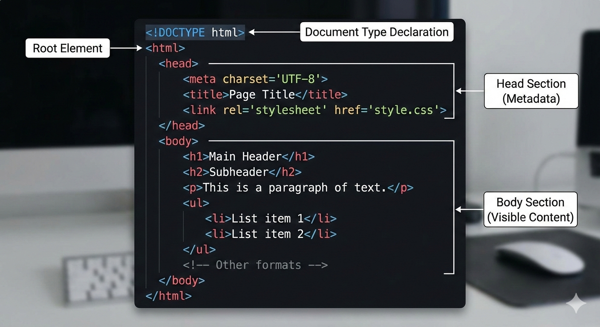

# HTML 

- [Video by Dr. Chuck on HTML Basics Part 1](https://youtu.be/ZV9SG8unDYc?si=HnqrgfUNofJDb_Dg): A beginner-friendly video explaining the fundamentals of HTML.

[Video by Dr. Chuck on HTML Basics Part 2](https://youtu.be/b99aHsUi7Zk?si=cuq9ayGqB-4pBvSX): A beginner-friendly video explaining the fundamentals of HTML.

<!-- Video Thumbnails 
[](https://youtu.be/ZV9SG8unDYc)

**Video by Dr. Chuck on HTML Basics Part 1** — A beginner-friendly video explaining the fundamentals of HTML.

[](https://youtu.be/b99aHsUi7Zk)

**Video by Dr. Chuck on HTML Basics Part 2** — A beginner-friendly video explaining the fundamentals of HTML.
-->

## Overview
HTML (HyperText Markup Language) is the standard markup language used to create web pages.

It provides the basic structure of a webpage, which is then enhanced and modified by other technologies like CSS and JavaScript.


## Key Concepts
1. **Elements and Tags**: HTML uses elements defined by tags (e.g., `<html>`, `<head>`, `<body>`, `<div>`, `<p>`, etc.) to structure content.
2. **Attributes**: Elements can have attributes that provide additional information about the element (e.g., `id`, `class`, `src`, `href`).
3. **Document Structure**: A typical HTML document includes a `<!DOCTYPE html>` declaration, `<html>`, `<head>`, and `<body>` sections.
4. **Semantic HTML**: Using HTML elements according to their meaning (e.g., `<article>`, `<section>`, `<nav>`, `<header>`, `<footer>`) to improve accessibility and SEO.
5. **Forms and Input**: HTML provides various form elements (e.g., `<input>`, `<textarea>`, `<select>`, `<button>`) to collect user data.
6. **Links and Navigation**: Hyperlinks are created using the `<a>` tag, allowing navigation between different pages or sections.
7. **Multimedia**: HTML supports embedding images, audio, and video using tags like ``, `<audio>`, and `<video>`.

## Basic Structure of an HTML Document

[Video explaining HTML Document Structure by Dr. Chuck Severance](https://youtu.be/tibwt3mVINM?si=-273SC_CIxdpfjNO)




Here is the structure of a basic HTML document:

```html
<!DOCTYPE html>
<html lang="en">
<head>
    <meta charset="UTF-8">
    <meta name="viewport" content="width=device-width, initial-scale=1.0">
    <title>Document Title</title>
</head>
<body>
    <h1>Hello, World!</h1>
    <p>This is a simple HTML document.</p>
</body>
</html>
```


## File names

- HTML files typically have the `.html` or `.htm` file extension. For example, `index.html` or `about.htm`. The choice between `.html` and `.htm` is largely historical, with `.htm` being used in older operating systems that had limitations on file name lengths.

- A file named `index.html` is often used as the default file that web servers look for when accessing a directory. For example, when you visit `www.example.com/`, the server will automatically serve the `index.html` file located in the root directory of the website.

- Can also be `index.php`, `index.asp`, etc., depending on the server-side technology used, but the concept remains the same.


## href attribute

The `href` attribute in HTML is used within the `<a>` (anchor) tag to specify the URL of the page or resource that the link points to. It stands for "hypertext reference."

Here is an example of how to use the `href` attribute:

```html
<a href="https://www.example.com">Visit Example.com</a>
```

In this example, the text "Visit Example.com" will be displayed as a clickable link. When a user clicks on this link, they will be directed to `https://www.example.com`.

- target attribute: You can use the `target` attribute to specify where to open the linked document. For example, `target="_blank"` opens the link in a new tab or window.

```html

<a href="https://www.example.com" target="_blank">Visit Example.com</a>

```


## Pretag in HTML

The `<pre>` tag in HTML is used to define preformatted text. Text within a `<pre>` element is displayed in a fixed-width font (usually Courier), and it preserves both spaces and line breaks. This is useful for displaying code snippets, ASCII art, or any text where the formatting (such as indentation) is important.

Here is an example of how to use the `<pre>` tag:

```html
<pre>
function helloWorld() {
    console.log("Hello, World!");
}
</pre>
```

This will render the text exactly as it appears within the `<pre>` tags, maintaining the indentation and line breaks.

## Document Object Model (DOM)

- The Document Object Model (DOM) is a programming interface for web documents. 

- It represents the structure of an HTML or XML document as a tree of objects, allowing programming languages like JavaScript to interact with and manipulate web pages dynamically.

- Each element in the HTML document is represented as a node in the DOM tree, and developers can use various methods to traverse, add, remove, or change these nodes.

- If you make mistakes in your HTML code, browsers will often try to correct them and still render the page, which can lead to unexpected behaviour. 

- The browser fixes the document structure to create a valid DOM, but this may not always align with the developer's intentions.

- Validating your HTML helps ensure that your code adheres to web standards and behaves consistently across different browsers.

- _Concept_: You can change the document structure using JavaScript by manipulating the DOM, allowing for interactive features.


## Historical Context

HTML was created by Tim Berners-Lee in 1991 as a way to share documents over the internet. Since then, it has evolved through various versions, with HTML5 being the latest standard, introducing new elements and APIs for modern web development.

- Next browser from CERN: [CERN Next Browser](https://next.cern.ch/)

The Next browser was one of the earliest web browsers developed at CERN, where Tim Berners-Lee worked. It played a crucial role in the initial adoption of the World Wide Web.

- NCSA Mosaic: [NCSA Mosaic](https://en.wikipedia.org/wiki/NCSA_Mosaic)

NCSA Mosaic was one of the first web browsers to gain widespread popularity, significantly contributing to the growth of the World Wide Web in the early 1990s.

Here is an image of the NCSA Mosaic browser (created using an AI image generator):


- Wayback Machine: [Wayback Machine](https://archive.org/web/)

The Wayback Machine is a digital archive of the World Wide Web, allowing users to access and view historical versions of web pages. It serves as a valuable resource for understanding the evolution of web design and content over time.

For example, here is what the Yahoo homepage looked like in 1996: [Yahoo 1996](https://web.archive.org/web/19961220154510/https://www.yahoo.com/)


## HTML is interpreted, not compiled

_Concept_: HTML is a markup language that is interpreted by web browsers. Unlike programming languages that require compilation, HTML code is read and rendered directly by the browser to display web pages.

Early web browsers, such as the WorldWideWeb developed by Tim Berners-Lee, interpreted HTML code to present content to users. This interpretation process allows for immediate rendering of web pages without the need for a separate compilation step.

When a user requests a web page, the browser retrieves the HTML file from the server and interprets the markup to construct the Document Object Model (DOM). The DOM represents the structure of the web page, which the browser then uses to render the visual layout and content.

- _Concept_: Interpretation vs. Compilation. 
    - Interpretation: HTML is read and rendered directly by the browser.
    - Compilation: Programming languages like C or Java require a separate compilation step to convert code into machine-readable format.

- Syntax leniency in early HTML

Early HTML could also tolerate minor syntax errors, allowing browsers to display content even if the HTML code was not perfectly formatted. This leniency helped in the rapid adoption of HTML as a standard for web content.

This motivated the creation of the W3C Consortium to establish formal standards for HTML and other web technologies, ensuring consistency and compatibility across different browsers and platforms.

## W3C Consortium

The World Wide Web Consortium (W3C) is an international community that develops open standards to ensure the long-term growth of the Web. Founded in 1994 by Tim Berners-Lee, the W3C aims to lead the Web to its full potential by creating protocols and guidelines that ensure interoperability and accessibility.

- Open standards: W3C develops standards for web technologies such as HTML, CSS, XML, and more.

- No proprietary control: W3C standards are open and free to use, promoting innovation and collaboration.

* _New rules for writing HTML established by W3C:_

- Tags must be closed: For example, `<br>` should be written as `<br />` in XHTML.
- Lowercase tags: All HTML tags should be written in lowercase (e.g., `<div>`, not `<DIV>`).
- Proper nesting: HTML elements must be properly nested within each other.


## HTML validation

- HTML validation is the process of checking an HTML document against a set of rules defined by the W3C to ensure that the code is syntactically correct and adheres to web standards. 

- Validating HTML helps improve the quality, accessibility, and compatibility of web pages across different browsers and devices.

- To validate an HTML document, you can use the W3C Markup Validation Service, which is an online tool provided by the W3C. You can access it at: [W3C Markup Validation Service](https://validator.w3.org/)

- CSS validation can also be performed using the W3C CSS Validation Service: [W3C CSS Validation Service](https://jigsaw.w3.org/css-validator/)

- You can validate your HTML by either entering the URL of a live webpage, uploading an HTML file from your computer, or directly pasting your HTML code into the provided text area on the validation service page.


## HTML special characters

In HTML, certain characters have special meanings and cannot be used directly in the content. To include these characters in your HTML document, you need to use character entities or escape sequences.

Here are some common HTML special characters and their corresponding entities:
| Character | Entity Code | Description          |
|-----------|-------------|----------------------|
| `<`       | `&lt;`      | Less than            |
| `>`       | `&gt;`      | Greater than         |
| `&`       | `&amp;`     | Ampersand            |
| `"`       | `&quot;`    | Double quotation mark|
| `'`       | `&apos;`    | Single quotation mark|
| ` `       | `&nbsp;`    | Non-breaking space   |

To use these special characters in your HTML content, simply replace them with their corresponding entity codes. For example, to display the text "5 < 10", you would write:

```html
<p> 5 &lt; 10 

</p>
```

## HTML Comments

In HTML, comments are used to add notes or explanations within the code that are not displayed in the web browser. Comments can be helpful for documenting the code, explaining complex sections, or temporarily disabling parts of the code during development.

HTML comments are created using the following syntax:

```html
<!-- This is a comment in HTML -->
```
Comments start with `<!--` and end with `-->`. Any text placed between these markers will be treated as a comment and ignored by the browser.


## Absolute vs. Relative URLs

When linking to resources in HTML, you can use either absolute or relative URLs.

- **Absolute URL**: An absolute URL specifies the complete path to a resource, including the protocol (e.g., `http://` or `https://`), domain name, and the full path to the file. For example:
  
  ```html
  <a href="https://www.example.com/page.html">Visit Example</a>
  ```

- **Relative URL**: A relative URL specifies the path to a resource relative to the current document's location. It does not include the protocol or domain name. For example, if your HTML file is located at `https://www.example.com/folder/index.html`, a relative link to `page.html` in the same folder would be written as:
  
  ```html
  <a href="page.html">Visit Page</a>
  ```


## Tables in HTML

Tables in HTML are created using the `<table>` element, which contains rows defined by `<tr>` (table row) elements. Each row can contain header cells (`<th>`) and data cells (`<td>`).

Here is a simple example of an HTML table:

```html
<table border="1">
  <tr>
    <th>Header 1</th>
    <th>Header 2</th>
  </tr>
  <tr>
    <td>Data 1</td>
    <td>Data 2</td>
  </tr>
  <tr>
    <td>Data 3</td>
    <td>Data 4</td>
  </tr>
</table>
```

- Tables were commonly used for layout in early web design but are now primarily used for displaying tabular data.

- Modern web design uses CSS for layout and styling, while tables are reserved for data representation.

- Next lecture: CSS (Cascading Style Sheets) for styling HTML documents.


## Resources

- [Video by Dr. Chuck on HTML Basics](https://youtu.be/ZV9SG8unDYc?si=HnqrgfUNofJDb_Dg): A beginner-friendly video explaining the fundamentals of HTML.

## Extras

