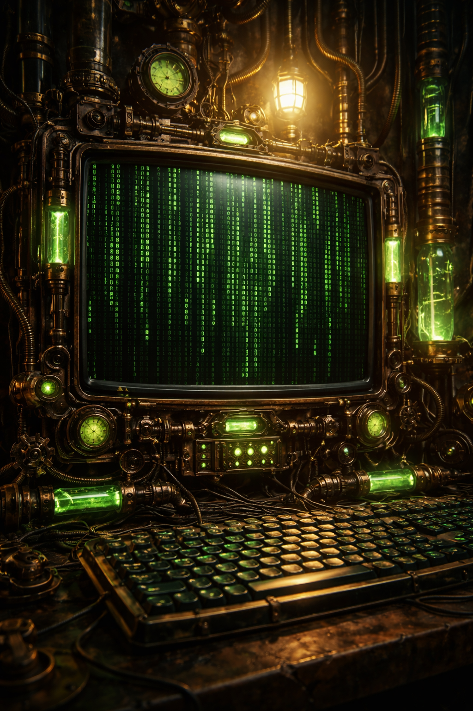

# Matrix-style Terminal 

Who does not like the movie *The Matrix*? The iconic green-on-black "digital rain" terminal has inspired generations of programmers.



## Plain Markdown fallback (works everywhere)

If the animated version won't run on your platform, paste this static code block into your Markdown to show a "terminal-looking" snippet:

```bash
guest@neo:~$ whoami
guest
guest@neo:~$ echo "Welcome to command-line 101"
Welcome to command-line 101
guest@neo:~$ ls -la
total 32
-rw-r--r-- 1 guest staff  142 Dec 17  2025 README.md
drwxr-xr-x 6 guest staff  192 Dec 17  2025 lab1
guest@neo:~$ cat README.md
Learning the command line gives you superpowers: navigation, automation, debugging.

# Tips:
 - Start simple: cd, ls, cat, mkdir, rm (careful!)
 - Combine commands with pipes: grep, awk, sed
 - Use the terminal to automate repetitive tasks

guest@neo:~$ 
```


## Command Line Starter Worksheet

**Course:** Web Development / Computing Fundamentals
**Level:** 1st-year undergraduate
**Time:** ~30–40 minutes

---

## Motivation: Why the Command Line?

In films like *The Matrix*, hackers don’t click buttons — they *talk directly to the computer*. While real command-line work is less dramatic, it gives you powerful abilities:

* Navigate your computer quickly
* Inspect files and folders
* Automate repetitive tasks
* Understand how web servers really work

In this worksheet, you’ll practise the **core commands** that underpin web development, servers, and deployment.

---

## Setup (5 minutes)

Open a terminal:

* **macOS:** Terminal app
* **Linux:** Terminal
* **Windows:** WSL (Ubuntu) or Git Bash

You should see a prompt similar to:

```
username@computer:~$
```

---

## Exercise 1: Who and Where Am I? (5 minutes)

Type the following commands, one at a time:

```bash
whoami
pwd
```

**Questions:**

1. What username is printed?
2. What directory are you currently in?
3. What does `~` represent?

---

## Exercise 2: Exploring Files and Folders (5 minutes)

Run:

```bash
ls
ls -l
ls -la
```

**Questions:**

1. What changes when you add `-l`?
2. What extra files appear with `-a`?
3. What do file permissions (e.g. `rw-r--r--`) roughly mean?

---

## Exercise 3: Creating Your First Project (10 minutes)

Create a folder for this course:

```bash
mkdir web-dev
cd web-dev
```

Now create a file:

```bash
echo "Hello, command line" > README.txt
cat README.txt
```

**Questions:**

1. What does `>` do?
2. What does `cat` stand for?
3. Why might this be useful for web projects?

---

## Exercise 4: Searching Like a Hacker (10 minutes)

Add more text:

```bash
echo "The command line gives you superpowers" >> README.txt
echo "Web servers love terminals" >> README.txt
```

Now search inside the file:

```bash
grep "command" README.txt
```

**Questions:**

1. What lines are printed?
2. What happens if you search for a word that doesn’t exist?
3. How might this help when debugging code or logs?

---

## Exercise 5: One-Line Superpowers (5 minutes)

Try this:

```bash
ls -la | grep README
```

```bash
curl https://www.example.com | grep "<title>"
```

```bash
wget -q -O - https://www.example.com | grep "<h1>"
```


**Questions:**

1. What does the pipe symbol `|` do?
2. How is this different from running the commands separately?
3. Why is this powerful for automation?

---

## Challenge (Optional)

Try to:

* Create a folder called `lab1`
* Create a file called `index.html`
* Print its contents to the terminal

*Hint: combine `mkdir`, `cd`, `echo`, and `cat`.*

---

## Takeaway

> The command line is not about memorising commands — it’s about **thinking in steps**, **combining tools**, and **controlling the machine**.

Everything you do here connects directly to:

* Web servers (Apache, Nginx)
* Deployment
* Debugging
* Automation

Next: using the terminal to run a local web server 🚀


> **Note:** The animated version below uses raw HTML, CSS and JavaScript embedded in Markdown. It runs in Markdown viewers that allow inline `<script>`/`<style>` (e.g. VS Code's Markdown preview, many static-site generators). If your Markdown host strips scripts (e.g. GitHub README), use the **Plain Markdown fallback** at the end of this file.

<!-- =========================
     Animated Matrix Terminal
     ========================= -->
<div class="matrix-terminal-wrapper" aria-hidden="false">
  <canvas id="matrixCanvas"></canvas>

  <div class="terminal-window" role="region" aria-label="Matrix terminal demo">
    <pre id="terminalOutput" aria-live="polite"></pre><span id="cursor">█</span>
  </div>
</div>

<style>
/* Container sizing - keeps the demo compact inside Markdown */
.matrix-terminal-wrapper {
  position: relative;
  width: 100%;
  max-width: 900px;
  height: 360px;
  margin: 0.6em auto;
  border-radius: 8px;
  overflow: hidden;
  box-shadow: 0 8px 30px rgba(0,0,0,0.6);
  background: #000;
  font-family: "SFMono-Regular", Menlo, Monaco, "Courier New", monospace;
}

/* Canvas fills container */
.matrix-terminal-wrapper canvas {
  position: absolute;
  inset: 0;
  width: 100%;
  height: 100%;
  display: block;
}

/* Terminal overlay */
.terminal-window {
  position: absolute;
  inset: 16px;
  background: rgba(0,0,0,0.35);
  border-radius: 6px;
  padding: 12px;
  box-sizing: border-box;
  color: #8efc6e;
  font-size: 14px;
  line-height: 1.35;
  overflow: hidden;
  display: flex;
  align-items: flex-start;
  gap: 6px;
}

/* The typed text */
#terminalOutput {
  margin: 0;
  white-space: pre-wrap;
  word-break: break-word;
  flex: 1 1 auto;
}

/* Blinking cursor */
#cursor {
  color: #8efc6e;
  font-weight: 700;
  animation: blink 1s steps(2) infinite;
  margin-left: 2px;
}
@keyframes blink { 50% { opacity: 0; } }

/* Make sure canvas text is subtle behind terminal */
.matrix-terminal-wrapper::after {
  content: "";
  position: absolute;
  inset: 0;
  background: linear-gradient(180deg, rgba(0,0,0,0.0) 30%, rgba(0,0,0,0.55) 100%);
  pointer-events: none;
}
</style>

<script>
(() => {
  // Matrix rain
  const canvas = document.getElementById('matrixCanvas');
  const ctx = canvas.getContext('2d');

  function resize() {
    const rect = canvas.getBoundingClientRect();
    canvas.width = rect.width * devicePixelRatio;
    canvas.height = rect.height * devicePixelRatio;
    canvas.style.width = rect.width + 'px';
    canvas.style.height = rect.height + 'px';
    ctx.setTransform(devicePixelRatio, 0, 0, devicePixelRatio, 0, 0);
    initColumns();
  }

  let fontSize = 14;
  let columns, drops;
  function initColumns() {
    const width = canvas.clientWidth;
    columns = Math.floor(width / fontSize) + 1;
    drops = new Array(columns).fill(0).map(() => Math.floor(Math.random() * canvas.clientHeight));
  }

  const katakana = 'アァカサタナハマヤャラワガザダバパイィキシチニヒミリヰギジヂビピウゥクスツヌフムユュルグズヅブプエェケセテネヘメレヱゲゼデベペオォコソトノホモヨョロゴゾドボポヴ0123456789ABCDEFGHIJKLMNOPQRSTUVWXYZabcdefghijklmnopqrstuvwxyz';
  function draw() {
    const width = canvas.clientWidth;
    const height = canvas.clientHeight;

    ctx.fillStyle = 'rgba(0,0,0,0.075)';
    ctx.fillRect(0, 0, width, height);

    ctx.font = fontSize + 'px monospace';
    for (let i = 0; i < columns; i++) {
      const text = katakana.charAt(Math.floor(Math.random() * katakana.length));
      const x = i * fontSize;
      const y = drops[i] * fontSize;

      // Leading bright glyph
      ctx.fillStyle = 'rgba(180,255,180,0.95)';
      ctx.fillText(text, x, y);

      // Slightly faded glyph behind
      ctx.fillStyle = 'rgba(80,200,80,0.65)';
      ctx.fillText(text, x, y - fontSize);

      drops[i]++;
      if (drops[i] * fontSize > height + Math.random() * 1000) {
        drops[i] = 0;
      }
    }
  }

  // Typing terminal
  const terminal = document.getElementById('terminalOutput');
  const cursor = document.getElementById('cursor');

  const scriptLines = [
    'guest@neo:~$ whoami',
    'guest',
    'guest@neo:~$ echo "Welcome to command-line 101"',
    'Welcome to command-line 101',
    'guest@neo:~$ ls -la',
    'total 32',
    '-rw-r--r-- 1 guest staff  142 Dec 17  2025 README.md',
    'drwxr-xr-x 6 guest staff  192 Dec 17  2025 lab1',
    'guest@neo:~$ cat README.md',
    'Learning the command line gives you superpowers: navigation, automation, debugging.',
    '',
    '# Tips:',
    ' - Start simple: cd, ls, cat, mkdir, rm (careful!)',
    ' - Combine commands with pipes: grep, awk, sed',
    ' - Use the terminal to automate repetitive tasks',
    '',
    'guest@neo:~$ _' // trailing underscore to simulate prompt
  ];

  let lineIndex = 0;
  let charIndex = 0;
  let typing = true;

  function typeNextChar() {
    if (lineIndex >= scriptLines.length) {
      // loop a gentle pause and then restart
      setTimeout(() => {
        terminal.textContent = '';
        lineIndex = 0;
        charIndex = 0;
      }, 3000);
      return;
    }
    const currentLine = scriptLines[lineIndex];
    if (charIndex <= currentLine.length) {
      // update displayed text (including new line if finished)
      const before = scriptLines.slice(0, lineIndex).join('\n');
      const partial = currentLine.slice(0, charIndex);
      terminal.textContent = (before ? before + '\n' : '') + partial;
      charIndex++;
    } else {
      // move to next line after a short pause
      lineIndex++;
      charIndex = 0;
      setTimeout(typeNextChar, 220 + Math.random() * 350);
      return;
    }
    setTimeout(typeNextChar, 22 + Math.random() * 28);
  }

  // Kick things off
  let matrixInterval;
  function start() {
    resize();
    if (matrixInterval) clearInterval(matrixInterval);
    matrixInterval = setInterval(draw, 45);
    typeNextChar();
  }

  // Responsive
  let resizeTimer;
  window.addEventListener('resize', () => {
    clearTimeout(resizeTimer);
    resizeTimer = setTimeout(resize, 120);
  });

  // initialize
  document.addEventListener('DOMContentLoaded', start);
  // also try immediate start in case DOMContentLoaded already fired
  if (document.readyState === 'complete' || document.readyState === 'interactive') start();
})();
</script>

<!-- =========================
     Plain Markdown fallback
     ========================= -->

