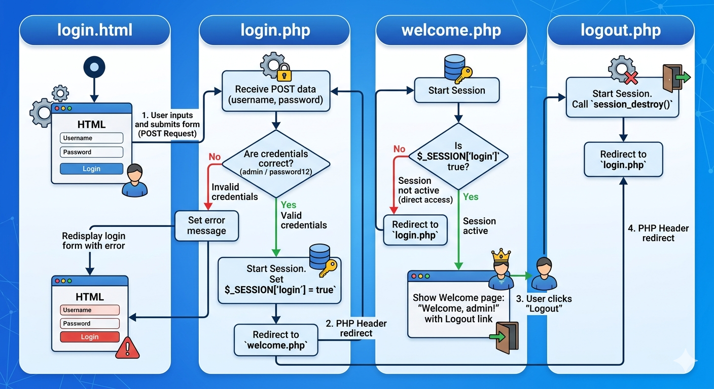
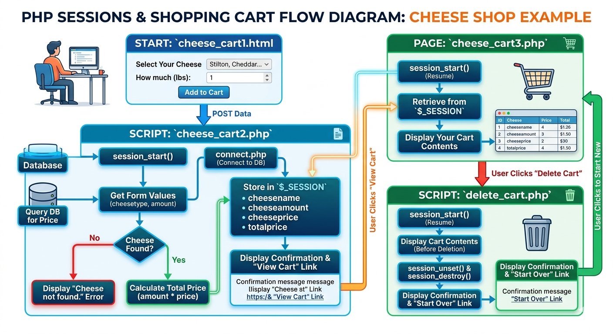

# Cookies and Sessions

- Cookies and sessions are two fundamental concepts in web development that help manage user state and data across multiple requests. Understanding how they work and when to use each is crucial for building effective web applications.

- [Video by Dr. Severance on cookies and sessions](https://youtu.be/WvGPeF-qHHQ?si=D6B-yKENhi8u39j7)
- [Video by Dr. Severance on sessions](https://youtu.be/DbHZ5THxt4s?si=26kJmJ4tfmYo-uJZ)


## What are cookies?

- Cookies are temporary storage on client browser

- Server uses it store information

- Request/response is stateless. So you need a mechanism to save state.

- Little breadcrumnbs/cookies to save state

## Code

```html

<?php
// Note - cannot have any output before setcookie
if (! isset($_COOKIE['var_cookie']) ){
    setcookie('var_cookie', '23', time() + 4000);
}

print_r($_COOKIE);
?>

```

## Sessions

- [Video by Dr. Severance on sessions](https://youtu.be/DbHZ5THxt4s?si=26kJmJ4tfmYo-uJZ)

- Make state persist across request response cycles

- Shopping cart or login information stored in sessions

- A large random number that is hard to guess. Stored as key value pairs

- If you find out the number you can get access

- `session_start()`

- can now store value in `$_SESSION` variable

- `session_destroy()`

## Session code

- We will recreate a login system with sessions. The structure is shown in the image below:



- `login.html`

```html
<!DOCTYPE html>
<html lang="en">
<head>
    <meta charset="UTF-8">
    <title>Login</title>
</head>
<body>
    <h1>Login</h1>
    <form action="login.php" method="POST">
        <label for="username">Username:</label><br>
        <input type="text" id="username" name="username"><br><br>

        <label for="password">Password:</label><br>
        <input type="password" id="password" name="password"><br><br>

        <input type="submit" value="Login">
    </form>
</body>
</html>
```

- `login.php`

```php
<?php
session_start();

if (isset($_POST['username'], $_POST['password'])) {
    $username = $_POST['username'];
    $password = $_POST['password'];

    if ($username === 'admin' && $password === 'password12') {
        $_SESSION['login'] = true;
        header('Location: welcome.php');
        exit();
    } else {
        $error = "Invalid username or password.";
    }
}
?>

<!DOCTYPE html>
<html lang="en">
<head>
    <meta charset="UTF-8">
    <title>Login</title>
</head>
<body>
    <h1>Login</h1>

    <?php if (isset($error)): ?>
        <p style="color: red;"><?php echo $error; ?></p>
    <?php endif; ?>

    <form action="login.php" method="POST">
        <label for="username">Username:</label><br>
        <input type="text" id="username" name="username"><br><br>

        <label for="password">Password:</label><br>
        <input type="password" id="password" name="password"><br><br>

        <input type="submit" value="Login">
    </form>
</body>
</html>
```

- `welcome.php`

```php
<?php
session_start();

if (!isset($_SESSION['login']) || $_SESSION['login'] !== true) {
    header('Location: login.php');
    exit();
}
?>

<!DOCTYPE html>
<html lang="en">
<head>
    <meta charset="UTF-8">
    <title>Welcome</title>
</head>
<body>
    <h1>Welcome, admin!</h1>
    <p>You are logged in. The session variable <code>$_SESSION['login']</code> is set to <strong>true</strong>.</p>
    <a href="logout.php">Logout</a>
</body>
</html>
```

- `logout.php`

```php
<?php
session_start();
session_destroy();
header('Location: login.php');
exit();
?>
```

## Creating a shopping cart using sessions

- We will now create a shopping webpage with a _cart_ (see flow diagram below):



- `connect.php`

```php
<?php
$conn = mysqli_connect('localhost', 'alec.wells', 'password', 'username_cheesedb');

if (mysqli_connect_errno()) {
    echo "Database Not Connected: " . mysqli_connect_error();
    exit();
}
?>
```

- `cheese_cart1.html`

```html
<!DOCTYPE html>
<html>
<head><title>Cheese Shop</title></head>
<body>

<h2>Select Your Cheese</h2>

<form action="cheese_cart2.php" method="post">

    <label>Select Your Cheese:</label><br>
    <select name="cheesetype">
        <option value="Stilton">Stilton</option>
        <option value="Cheddar">Cheddar</option>
        <option value="Wensleydale">Wensleydale</option>
        <option value="Edam">Edam</option>
    </select>
    <br><br>

    <label>How much do you want (lbs):</label><br>
    <input type="number" name="amount" min="1" value="1">
    <br><br>

    <input type="submit" value="Add to Cart">

</form>

</body>
</html>
```


- `cheese_cart2.php`

```php
<?php
session_start();
require('connect.php');

// Get form values
$cheesename   = $_POST['cheesetype'];
$cheeseamount = $_POST['amount'];

// Query the database for the price
$sql = "SELECT * FROM Cheeses WHERE cheesetype = '$cheesename'";
$rs  = mysqli_query($conn, $sql);

if (!$rs) {
    die("Could not get data: " . mysqli_error($conn));
}

if ($row = mysqli_fetch_array($rs)) {
    $cheeseprice = $row['price'];
} else {
    die("Cheese not found.");
}

// Calculate total
$price = $cheeseamount * $cheeseprice;

// Store in session
$_SESSION['cheesename']   = $cheesename;
$_SESSION['cheeseamount'] = $cheeseamount;
$_SESSION['cheeseprice']  = $cheeseprice;
$_SESSION['totalprice']   = $price;

// Display result
echo "<p>You have selected " . $cheeseamount . " lbs of " . $cheesename;
echo " priced at £" . $cheeseprice . " per pound.</p>";
echo "<p>The price for this transaction is: £" . number_format($price, 2) . "</p>";
echo "<p><a href='cheese_cart3.php'>Go here to view your shopping cart</a></p>";
?>
```

- `cheese_cart3.php`

```php
<?php
session_start();
?>
<!DOCTYPE html>
<html>
<head><title>Your Cheese Cart</title></head>
<body>

<h2>Your cart currently contains:</h2>

<p>Cheese: <?php echo $_SESSION['cheesename']; ?></p>
<p>Amount (lbs): <?php echo $_SESSION['cheeseamount']; ?></p>
<p>At (per lb): £<?php echo $_SESSION['cheeseprice']; ?></p>
<p>Total price: £<?php echo number_format($_SESSION['totalprice'], 2); ?></p>

<p><a href="delete_cart.php">Go here to delete your shopping cart</a></p>

</body>
</html>
```

- `delete_cart.php`

```php
<?php
session_start();

// Show cart contents before destroying
echo "<h2>Your cart currently contained:</h2>";
echo "<p>Cheese: "     . $_SESSION['cheesename']              . "</p>";
echo "<p>Amount (lbs): " . $_SESSION['cheeseamount']          . "</p>";
echo "<p>At (per lb): £" . $_SESSION['cheeseprice']           . "</p>";
echo "<p>Total price: £" . number_format($_SESSION['totalprice'], 2) . "</p>";

// Destroy the session
session_unset();
session_destroy();

echo "<p><strong>Your cart has been cleared.</strong></p>";
echo "<p><a href='cheese_cart1.html'>Go here to start your new cheese experience</a></p>";
?>
```

## (Optional) Session code

```php
<?php
// Note - no output before this
session_start();

if ( !isset($_SESSION['value']) ){
    $_SESSION['value'] = 0;
} else {
    session_destroy();
    session_start();
}
?>

<p>
    < a href = "sessfun.php"> Click me 
    </a>
</p>

<pre>
    <?php
        print_r($_SESSION['value']);
    ?>
</pre>

```


## Sessions without cookies

[Video by Dr. Severance](https://youtu.be/syGzIkBLBGs?si=IfNCta_KPlujdD5l)

- Using `hidden` to send session ID.


- [Next: HCI fundamentals](HCI.md)
