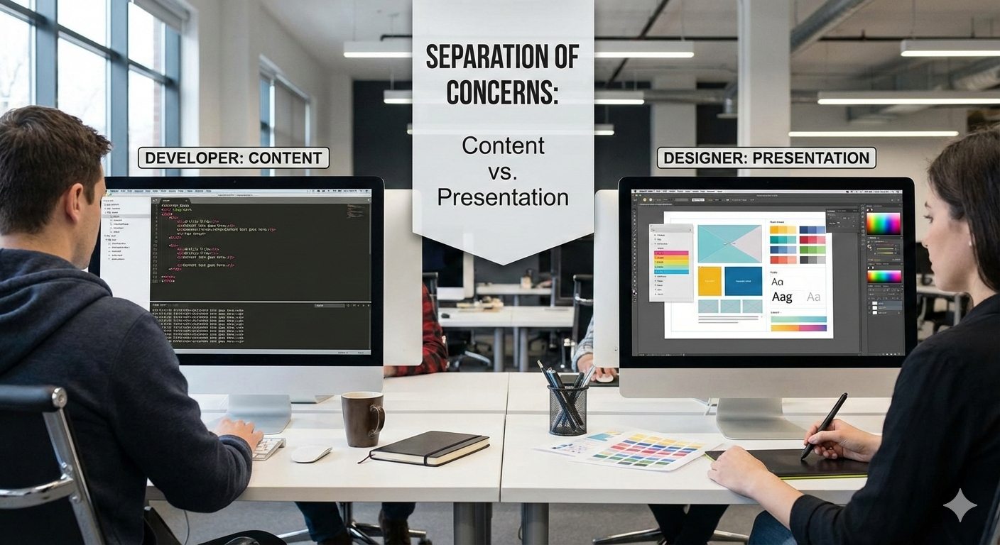

# Cascading Style Sheets (CSS) Fundamentals

- [Video by Dr. Chuck on CSS Basics Part 1](https://youtu.be/v6lfSzF8MuI?si=ZD6JdbHaU_lEGPHF): A beginner-friendly video explaining the fundamentals of CSS.

- [Video by Dr. Chuck on CSS Basics Part 2](https://youtu.be/aA587wqx0B0?si=4WRY_3YKvZgMsKVd): A continuation of the CSS basics, covering more advanced topics.

- [Video by Dr. Chuck on CSS Basics Part 3](https://youtu.be/SLiS4oQahuk?si=MIid0eo2CLZld67Z): The third part of the CSS basics series, focusing on practical applications.


# Installation/Playground

- [w3schools HTML playground](https://www.w3schools.com/html/tryit.asp?filename=tryhtml_basic): online HTML editor to practice HTML/CSS.

- [jsfiddle.net](https://jsfiddle.net/): Online editor for HTML, CSS, and JavaScript with live preview.

- [codepen.io](https://codepen.io/): Social development environment for front-end designers and developers.

- [replit.com](https://replit.com/languages/html): Online IDE supporting multiple programming languages, including HTML/CSS/JS.


### Introduction to CSS

#### 1.1 What is CSS?
- **CSS**: Cascading Style Sheets
- Controls presentation and layout
- _Concept_: Separates content from design
- _Concept_: User experience enhancement for the user as the Web evolved

#### 1.2 How CSS Works
- Cascading: Multiple style sources (browser, author, user)
- Inheritance: Child elements inherit parent styles
- Specificity: Which rule wins when conflicts occur

#### 1.3 Three Ways to Add CSS

**Inline CSS (avoid except for dynamic styles):**
```html
<p style="color: blue; font-size: 16px;">Text</p>
```

**Internal CSS:**
```html
<head>
    <style>
        p {
            color: blue;
            font-size: 16px;
        }
    </style>
</head>
```

**External CSS (best practice):**
```html
<head>
    <link rel="stylesheet" href="css/style.css">
</head>
```

```css
/* style.css */
p {
    color: blue;
    font-size: 16px;
}
```

### Web developer tools

- [Chris Pederick's Web Developer Extension](https://chrispederick.com/work/web-developer/): A browser extension that adds various web development tools.
- Browser DevTools (Inspect Element, Console, Network, etc.)


### Activity

- Disable CSS in your browser using Chris Pederick's Web Developer Extension and observe how the page layout changes.
- Try the following (admittedly badly designed) page with and without CSS: [CSS Zen Garden](http://www.csszengarden.com/)

- Without CSS, the content is still accessible, but the visual presentation is poor.

- Maybe important for visual impairments?

- Separation of concerns: content vs presentation _OR_ developer vs. designer




### CSS Selectors

- _Concept_: Anatomy of a CSS Rule:

```css
selector {
    property: value;
}
```
- For all `selectors`, CSS rules apply

- The `property` is what you want to change

- Think of it as a _paintbrush_ for HTML elements


#### Basic Selectors

**Element Selector:**
```css
p {
    color: black;
}

h1 {
    font-size: 32px;
}
```

**Class Selector:**
```css
.highlight {
    background-color: yellow;
}

.btn {
    padding: 10px 20px;
    border-radius: 5px;
}
```

```html
<p class="highlight">Highlighted text</p>
<button class="btn">Click Me</button>
```

**ID Selector:**
```css
#header {
    background-color: navy;
}

#main-content {
    padding: 20px;
}
```

```html
<div id="header">Header Content</div>
<div id="main-content">Main Content</div>
```

**Universal Selector:**
```css
* {
    margin: 0;
    padding: 0;
    box-sizing: border-box;
}
```

### CSS cheat sheet

- [Leslie Franklin's CSS Cheat Sheet](https://www.lesliefranke.com/files/reference/csscheatsheet.html): A comprehensive cheat sheet covering CSS properties, selectors, and more.

## Why cascading?

- Multiple sources of styles: browser defaults, user styles, author styles

- Specificity hierarchy: inline > ID > class > element

- _Concept_: The more specific the selector, the higher its priority

- _Concept_: Later rules override earlier ones if they have the same specificity


## Span and Div

- `<div>`: Block-level container for grouping elements
- `<span>`: Inline container for grouping text or elements
- Use for applying styles or scripts to specific sections of content

```html
<div class="container">
    <h1>Title</h1>
    <p>This is a <span class="highlight">highlighted</span> word.</p>
</div>
```

- spand and div are often used together with CSS to style specific parts of a webpage.

- _Concept_: span and div have no inherent visual effect; they are designed to be styled with CSS.

- _Concept_: this is so because other older elements had specific meanings and visual effects (like `<b>`, `<i>`, `<u>`, etc.)


## Syntax

- `#` means ID selector. Find element with that ID.

- `.` means class selector. Find all elements with that class.

- No prefix means element selector. Find all elements of that type.

- [Explanation of CSS Specificity](https://youtu.be/hEY4V_OWZAU?si=UG7FNBY2Y_SaZQnH): A video explaining how CSS specificity works.

- Example of specificity:

```css
/* Element selector */
p {
    color: black; /* specificity: 1 */
}
/* Class selector */
.highlight {
    color: blue; /* specificity: 10 */
}
/* ID selector */
#main {
    color: red; /* specificity: 100 */
}
```

## Colours

- [W3schools CSS Colors](https://www.w3schools.com/cssref/css_colors.asp): A reference for CSS color names and values.
- Named colors: `red`, `blue`, `green`, etc.
- Hexadecimal: `#RRGGBB` or `#RGB`
- RGB: `rgb(255, 0, 0)`
- RGBA: `rgba(255, 0, 0, 0.5)` (with alpha for transparency)
- HSL: `hsl(0, 100%, 50%)`
- HSLA: `hsla(0, 100%, 50%, 0.5)` (with alpha for transparency)

```css
/* Named color */
color: red; 
/* Hexadecimal */
color: #FF0000;
/* RGB */
color: rgb(255, 0, 0);
/* RGBA */
color: rgba(255, 0, 0, 0.5);
/* HSL */
color: hsl(0, 100%, 50%);
/* HSLA */
color: hsla(0, 100%, 50%, 0.5);
```

## Fonts

- [Google Fonts](https://fonts.google.com/): A library of free web fonts.
- `font-family`: Specifies the font type.
- `font-size`: Specifies the size of the font.
- `font-weight`: Specifies the weight (boldness) of the font.
- `font-style`: Specifies the style (normal, italic, oblique) of the font.


```css 
/* Font family */
font-family: Arial, Helvetica, sans-serif;
font-family: 'Times New Roman', serif;
font-family: 'Courier New', monospace;
/* Font size */
font-size: 16px;
font-size: 1.2em;  /* relative to parent */
font-size: 1.2rem; /* relative to root */
/* Font weight */
font-weight: normal;
font-weight: bold;
font-weight: 700;
/* Font style */
font-style: italic;
font-style: oblique;
/* Shorthand */
font: italic bold 16px/1.5 Arial, sans-serif;
```

- Example
 
```css
body {
    font-family: 'Roboto', sans-serif;
}
```

- Fallback fonts (in case the primary font is unavailable on the browser):

```css
font-family: 'Open Sans', Arial, sans-serif;
```

## Links

```css
/* Link states */
a:link { color: blue; }
a:visited { color: purple; }
a:hover { color: red; }
a:active { color: orange; }
```

## nav tag

- function of the `<nav>` tag is to define a section of navigation links in an HTML document.

```css
nav a {
    text-decoration: none;
    padding: 10px 15px;
    color: white;
    background-color: #333;
}   
nav a:hover {
    background-color: #555;
}
```


## Units `em`, `rem`, `%`, `px`

- `px`: Pixels, absolute unit.
- `em`: Relative to the font-size of the parent element.
- `rem`: Relative to the font-size of the root element (`<html>`).
- `%`: Relative to the parent element's size.

```css
/* Pixels (most common) */
font-size: 16px;    
/* em - relative to parent font-size */
font-size: 1.5em;  /* 1.5 times parent */
/* rem - relative to root (html) font-size */
font-size: 1.5rem;
/* Percentage */
width: 50%;
font-size: 120%;
/* Viewport units */
width: 50vw;  /* 50% of viewport width */
height: 100vh; /* 100% of viewport height */
font-size: 5vmin; /* 5% of smaller dimension */
```


## Motivating CSS: styles without CSS

- What if we styled a page without CSS?

- [Video by Dr. Chuck on Styling without CSS](https://youtu.be/SLiS4oQahuk?si=x_OPeTBGuCBb34OX): A video demonstrating the drawbacks of styling a webpage without CSS.

```html
<!DOCTYPE html>
<html>
<head>
    <title>Styled Page without CSS</title>
</head>
<body>
    <h1><font color="blue" size="7">Welcome to My Page</font></h1>
    <p><font color="green" size="4">This is a paragraph with inline font styling.</font></p>
    <a href="#" style="color: red; font-size: 20px;">This is a styled link</a>
</body>
</html>
```

- Why is this bad?
    - Mixing content and presentation
    - Difficult to maintain and update styles
    - Limited styling options
    - Deprecated tags and attributes

- Better approach: Use CSS for styling

```html
<!DOCTYPE html>
<html>
<head>
    <title>Styled Page with CSS</title>
    <link rel="stylesheet" href="styles.css">
</head>
<body>
    <h1 class="title">Welcome to My Page</h1>
    <p class="paragraph">This is a paragraph with CSS styling.</p>
    <a href="#" class="styled-link">This is a styled link</a>
</body>
</html>
```

```css
/* styles.css */
.title {
    color: blue;
    font-size: 3em;
}
.paragraph {
    color: green;
    font-size: 1.5em;
}
.styled-link {
    color: red;
    font-size: 1.25em;
}
```


#### 2.2 Combinators

**Descendant Selector (space):**
```css
/* All p elements inside div */
div p {
    color: blue;
}
```

**Child Selector (>):**
```css
/* Only direct children */
div > p {
    font-weight: bold;
}
```

**Adjacent Sibling (+):**
```css
/* p immediately after h2 */
h2 + p {
    margin-top: 0;
}
```

**General Sibling (~):**
```css
/* All p elements after h2 */
h2 ~ p {
    color: gray;
}
```

#### 2.3 Attribute Selectors

```css
/* Has attribute */
input[required] {
    border: 2px solid red;
}

/* Exact value */
input[type="email"] {
    background-color: lightyellow;
}

/* Contains value */
a[href*="example"] {
    color: green;
}

/* Starts with */
a[href^="https"] {
    padding-left: 20px;
}

/* Ends with */
a[href$=".pdf"] {
    color: red;
}
```

#### 2.4 Pseudo-classes

```css
/* Link states */
a:link { color: blue; }
a:visited { color: purple; }
a:hover { color: red; }
a:active { color: orange; }

/* Form states */
input:focus {
    outline: 2px solid blue;
}

input:disabled {
    background-color: #eee;
}

input:checked + label {
    font-weight: bold;
}

/* Structural */
li:first-child {
    font-weight: bold;
}

li:last-child {
    border-bottom: none;
}

li:nth-child(odd) {
    background-color: #f0f0f0;
}

li:nth-child(3n) {
    color: red;
}

p:not(.special) {
    color: gray;
}
```

#### 2.5 Pseudo-elements

```css
/* First line/letter */
p::first-line {
    font-weight: bold;
}

p::first-letter {
    font-size: 2em;
    float: left;
}

/* Before/After */
.quote::before {
    content: """;
    font-size: 2em;
}

.quote::after {
    content: """;
    font-size: 2em;
}

/* Selection */
::selection {
    background-color: yellow;
    color: black;
}
```

### Part 3: CSS Properties (60 minutes)

#### 3.1 Color and Background

**Color Values:**
```css
/* Named colors */
color: red;

/* Hexadecimal */
color: #FF0000;
color: #F00; /* shorthand */

/* RGB */
color: rgb(255, 0, 0);

/* RGBA (with transparency) */
color: rgba(255, 0, 0, 0.5);

/* HSL */
color: hsl(0, 100%, 50%);

/* HSLA */
color: hsla(0, 100%, 50%, 0.5);
```

**Background Properties:**
```css
.element {
    background-color: #f0f0f0;
    background-image: url('bg.jpg');
    background-repeat: no-repeat;
    background-position: center center;
    background-size: cover;
    background-attachment: fixed;
    
    /* Shorthand */
    background: #f0f0f0 url('bg.jpg') no-repeat center/cover;
}

/* Multiple backgrounds */
.hero {
    background: 
        url('overlay.png'),
        url('photo.jpg');
    background-size: cover, cover;
}

/* Gradients */
.gradient {
    background: linear-gradient(to right, red, blue);
    background: linear-gradient(45deg, red, yellow, blue);
    background: radial-gradient(circle, red, blue);
}
```

#### 3.2 Text Styling

**Font Properties:**
```css
.text {
    /* Font family */
    font-family: Arial, Helvetica, sans-serif;
    font-family: 'Times New Roman', serif;
    font-family: 'Courier New', monospace;
    
    /* Font size */
    font-size: 16px;
    font-size: 1.2em;  /* relative to parent */
    font-size: 1.2rem; /* relative to root */
    
    /* Font weight */
    font-weight: normal;
    font-weight: bold;
    font-weight: 700;
    
    /* Font style */
    font-style: italic;
    font-style: oblique;
    
    /* Shorthand */
    font: italic bold 16px/1.5 Arial, sans-serif;
}
```

**Text Properties:**
```css
.paragraph {
    /* Alignment */
    text-align: left;
    text-align: center;
    text-align: right;
    text-align: justify;
    
    /* Decoration */
    text-decoration: underline;
    text-decoration: line-through;
    text-decoration: none;
    
    /* Transform */
    text-transform: uppercase;
    text-transform: lowercase;
    text-transform: capitalize;
    
    /* Spacing */
    letter-spacing: 2px;
    word-spacing: 5px;
    line-height: 1.6;
    
    /* Indent */
    text-indent: 50px;
    
    /* Shadow */
    text-shadow: 2px 2px 4px rgba(0,0,0,0.3);
}
```

**Web Fonts:**
```html
<!-- Google Fonts -->
<link href="https://fonts.googleapis.com/css2?family=Roboto:wght@400;700&display=swap" rel="stylesheet">
```

```css
body {
    font-family: 'Roboto', sans-serif;
}
```

#### 3.3 Units of Measurement

**Absolute Units:**
```css
/* Pixels (most common) */
font-size: 16px;

/* Points (print) */
font-size: 12pt;

/* Inches, cm, mm (rarely used) */
width: 2in;
```

**Relative Units:**
```css
/* em - relative to parent font-size */
font-size: 1.5em;  /* 1.5 times parent */

/* rem - relative to root (html) font-size */
font-size: 1.5rem;

/* Percentage */
width: 50%;
font-size: 120%;

/* Viewport units */
width: 50vw;  /* 50% of viewport width */
height: 100vh; /* 100% of viewport height */
font-size: 5vmin; /* 5% of smaller dimension */
```

### Part 4: The Box Model

#### 4.1 Understanding the Box Model

Every element is a rectangular box with:
1. **Content**: The actual content
2. **Padding**: Space inside the border
3. **Border**: Line around padding
4. **Margin**: Space outside the border

```css
.box {
    /* Content area */
    width: 300px;
    height: 200px;
    
    /* Padding (inside) */
    padding: 20px;
    padding: 10px 20px; /* vertical horizontal */
    padding: 10px 20px 30px 40px; /* top right bottom left */
    
    /* Border */
    border: 2px solid black;
    border-width: 2px;
    border-style: solid;
    border-color: black;
    border-radius: 10px;
    
    /* Margin (outside) */
    margin: 20px;
    margin: 10px auto; /* center horizontally */
    
    /* Box-sizing */
    box-sizing: border-box; /* includes padding and border in width */
}
```

#### 4.2 Box Sizing

**Content-box (default):**
```css
.box {
    width: 300px;
    padding: 20px;
    border: 5px solid black;
    /* Actual width = 300 + 40 + 10 = 350px */
}
```

**Border-box (recommended):**
```css
* {
    box-sizing: border-box;
}

.box {
    width: 300px;
    padding: 20px;
    border: 5px solid black;
    /* Actual width = 300px (includes padding and border) */
}
```

#### 4.3 Display Property

```css
/* Block elements (full width) */
div {
    display: block;
}

/* Inline elements (only content width) */
span {
    display: inline;
}

/* Inline-block (inline but can have width/height) */
.button {
    display: inline-block;
    width: 200px;
    padding: 10px;
}

/* Hide element */
.hidden {
    display: none;
}

/* Flex and Grid (next week) */
.container {
    display: flex;
    display: grid;
}
```

#### 4.4 Visibility

```css
/* Hide but keep space */
.invisible {
    visibility: hidden;
}

/* Hide completely */
.gone {
    display: none;
}

/* Transparent */
.see-through {
    opacity: 0.5;
}
```

### Part 5: Positioning (30 minutes)

#### 5.1 Position Property

**Static (default):**
```css
.element {
    position: static; /* Normal flow */
}
```

**Relative:**
```css
.element {
    position: relative;
    top: 20px;    /* Move down from normal position */
    left: 10px;   /* Move right from normal position */
}
```

**Absolute:**
```css
.parent {
    position: relative;
}

.child {
    position: absolute;
    top: 0;
    right: 0; /* Position relative to parent */
}
```

**Fixed:**
```css
.navbar {
    position: fixed;
    top: 0;
    left: 0;
    width: 100%;
    z-index: 1000; /* Stack order */
}
```

**Sticky:**
```css
.sidebar {
    position: sticky;
    top: 20px; /* Sticks when scrolling */
}
```

#### 5.2 Z-index

```css
.layer1 {
    position: relative;
    z-index: 1;
}

.layer2 {
    position: relative;
    z-index: 2; /* Appears on top */
}

.modal {
    position: fixed;
    z-index: 9999; /* Very top */
}
```

#### 5.3 Float (legacy layout)

```css
.sidebar {
    float: left;
    width: 30%;
}

.main {
    float: right;
    width: 68%;
}

.clearfix::after {
    content: "";
    display: table;
    clear: both;
}
```

## Activity

🛠️ Teaching Tools & Platforms

- Live coding in VS Code + Live Server (set up and demo CSS changes in real time).

- Online editors like CodePen/JSFiddle for student experimentation.

- Weekly small projects (e.g., style a resume, build a responsive navbar).

## Key Takeaways

1. CSS selectors target HTML elements for styling
2. Specificity determines which styles apply
3. Box model controls spacing and layout
4. Position property controls element placement
5. Use relative units for responsive design

## Practice Exercises

1. Create a styled button with hover effects
2. Build a card component with image and text
3. Style a navigation menu
4. Create a hero section with background image


## Assignments


### 🚀 Part 1: In-Class Activity (30–45 minutes)

### *“Deploy Your First Stylised Website”*

### Learning goals

By the end of the activity, students will:

* Publish a webpage using **GitHub Pages**
* Link an external **CSS stylesheet**
* Use basic CSS to control **layout, colour, fonts, and spacing**
* Experience the joy of seeing something “live” on the internet

---

## Activity Brief (Student-Facing)

> You will create and publish a **single-page website** on `github.io`, styled using CSS.
> Choose a theme:
>
> * **XKCD-style comic page**
> * **Star Wars opening crawl**
> * **Retro terminal / hacker page**
> * **Your own fun theme**

Your page must be **online** by the end of the session.

---

## Step-by-Step Instructions

### 1️⃣ Setup (10 minutes)

1. Create a GitHub account (if needed).

2. Create a new repository called:

   ```
   username.github.io
   ```

3. Add two files:

   * `index.html`
   * `style.css`

4. Enable **GitHub Pages**
   → Settings → Pages → Deploy from main branch

---

### 2️⃣ Starter HTML (provided)

```html
<!DOCTYPE html>
<html lang="en">
<head>
  <meta charset="UTF-8">
  <title>My Fun Webpage</title>
  <link rel="stylesheet" href="style.css">
</head>
<body>

  <header>
    <h1>Welcome to My Page</h1>
    <p>A long time ago, in a browser far, far away…</p>
  </header>

  <main>
    <section>
      <h2>About</h2>
      <p>This page is styled entirely with CSS.</p>
    </section>
  </main>

</body>
</html>
```

---

### 3️⃣ CSS Challenge (20 minutes)

Students must:

* Change background colour or gradient
* Choose a font (system font or Google Fonts)
* Style headings differently from body text
* Center or animate at least one element

#### Example: Star Wars-Style Crawl

```css
body {
  background: black;
  color: yellow;
  font-family: 'Arial', sans-serif;
  overflow: hidden;
}

main {
  width: 60%;
  margin: auto;
  font-size: 1.5em;
  text-align: justify;
  animation: crawl 20s linear infinite;
}

@keyframes crawl {
  from { transform: translateY(100%); }
  to { transform: translateY(-200%); }
}
```

#### Example: XKCD-Style

```css
body {
  font-family: "Comic Sans MS", cursive;
  background: white;
  color: black;
}

h1 {
  border-bottom: 2px solid black;
}

section {
  max-width: 600px;
  margin: auto;
}
```

---

### 4️⃣ Show & Tell (5–10 minutes)

* Students paste their live URLs in chat
* Quick gallery walk
* Vote for:

  * *Funniest*
  * *Most Stylish*
  * *Most Ridiculous*

🏆 Small prizes or bragging rights recommended.

---

# 🌌 Part 2: Larger Assignment (Take-Home, 1–2 weeks)

### *“Theme Website: Style as Storytelling”*

---

## Assignment Brief

Create a **themed website** hosted on GitHub Pages that uses **CSS to express a narrative or aesthetic**.

You may work **individually or in pairs**.

### Suggested Themes

* XKCD-inspired explainer page
* Star Wars opening crawl (with multiple sections)
* “Old Internet” (GeoCities vibes)
* Sci-fi terminal interface
* Minimalist academic homepage
* Fake startup landing page

---

## Technical Requirements (Graded)

Your site **must include**:

### HTML

* At least **3 sections** (`header`, `main`, `footer` or similar)
* Semantic HTML (`section`, `nav`, `article`)
* Clean indentation

### CSS

* External stylesheet
* At least:

  * 3 selectors
  * 1 class selector
  * 1 ID selector
* Use of:

  * Fonts
  * Colours
  * Spacing (margin/padding)
* One of:

  * Animation
  * Hover effect
  * Responsive layout (media query)

### Deployment

* Hosted on `username.github.io`
* Public repository
* Working URL submitted

---

## Marking Rubric (Example)

| Criterion                 | Marks   |
| ------------------------- | ------- |
| CSS correctness & clarity | 30      |
| Visual creativity & theme | 25      |
| HTML structure            | 20      |
| GitHub Pages deployment   | 15      |
| Code readability          | 10      |
| **Total**                 | **100** |

---

## Optional Stretch Goals 🌟

* Use Flexbox or Grid
* Dark/light mode toggle
* Embedded image or SVG
* Accessibility (contrast, readable fonts)

---

