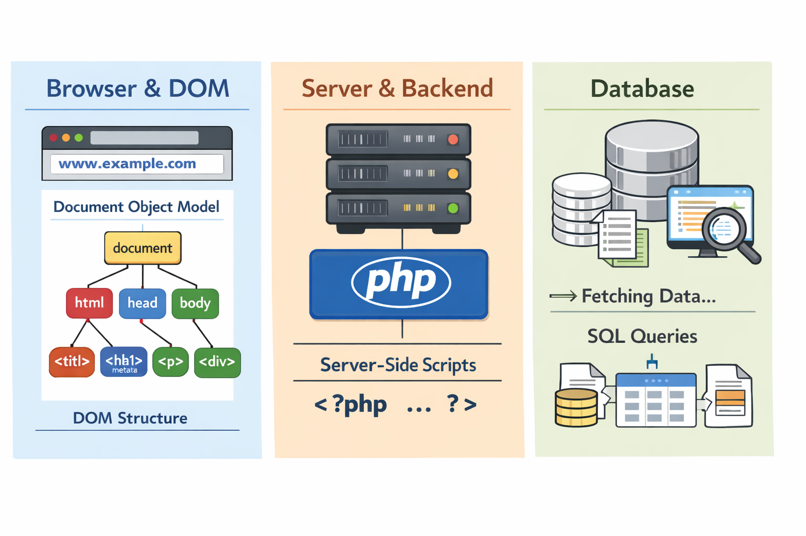
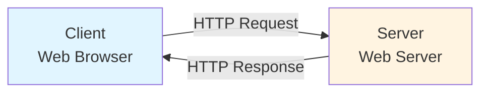
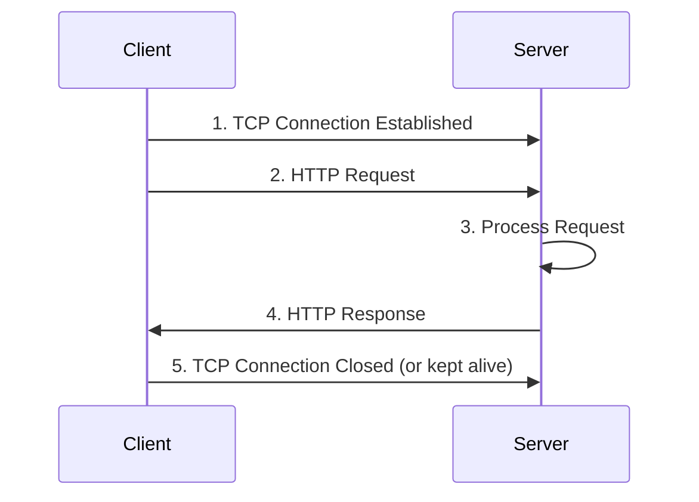
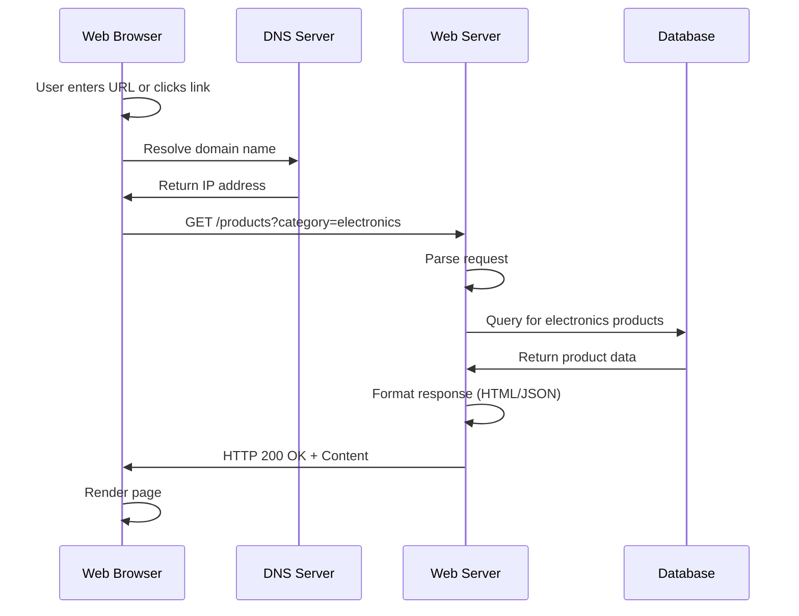
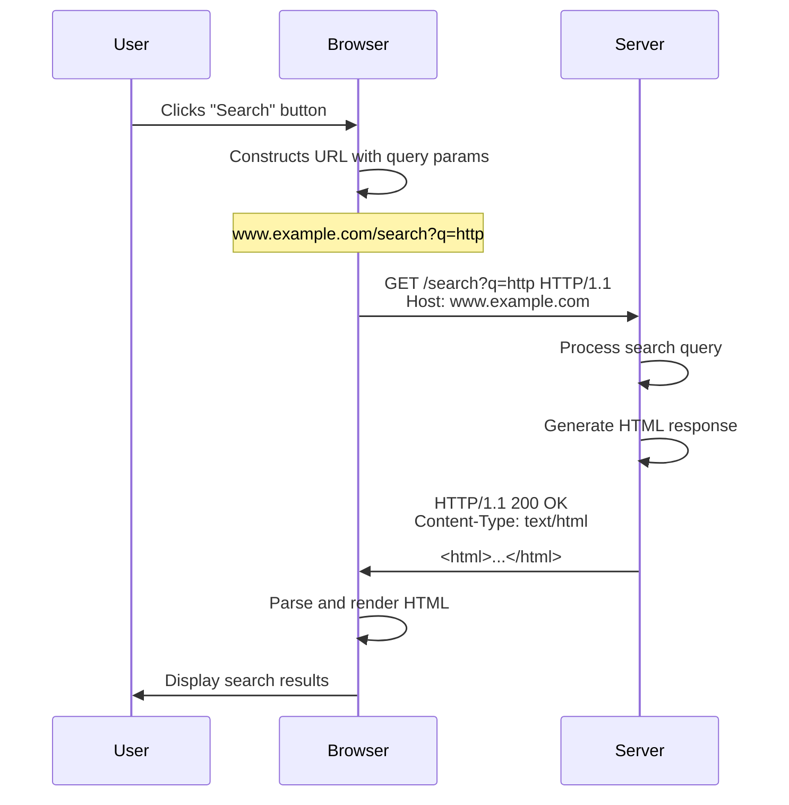
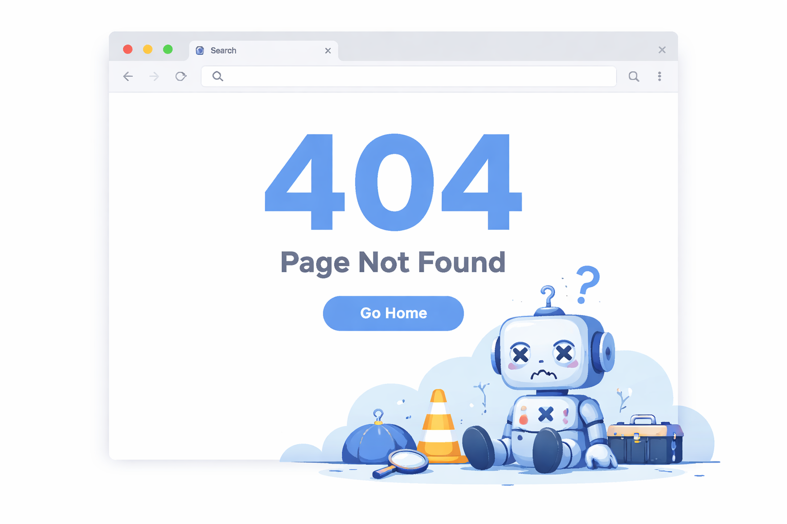

# Introduction to GET request method

# HTTP GET Requests and Client-Server Architecture

## Client-Server Architecture

- [Coursera Video: Client-Server Model](https://www.coursera.org/learn/web-applications-php/lecture/6fbNG/request-response-cycle)

- The web operates on a client-server model where clients (typically web browsers) request resources from servers, which then respond with the requested data.





### Key Components

**Client**: The client is typically a web browser (Chrome, Firefox, Safari) or any application that initiates HTTP requests. The client is responsible for:
- Sending HTTP requests to servers
- Rendering HTML, CSS, and executing JavaScript
- Displaying content to the user
- Managing cookies and sessions

**Server**: The server is a computer that hosts web applications and responds to client requests. The server is responsible for:
- Listening for incoming HTTP requests
- Processing requests and executing business logic
- Accessing databases or other resources
- Sending HTTP responses back to clients

## HTTP Protocol

HTTP (Hypertext Transfer Protocol) is the foundation of data communication on the web. It's a request-response protocol that operates on top of TCP/IP.



## GET Requests

GET is one of the most common HTTP methods. It's used to **retrieve** data from a server without modifying anything on the server.

### Characteristics of GET Requests

- **Idempotent**: Multiple identical GET requests should have the same effect as a single request
- **Cacheable**: Responses can be cached by browsers and proxies
- **Parameters in URL**: Query parameters are visible in the URL
- **Bookmarkable**: URLs with GET parameters can be saved and shared
- **Length Limitations**: URLs have maximum length restrictions (typically ~2000 characters)
- **No Request Body**: Data is sent only via URL parameters

### Anatomy of a GET Request

```
GET /api/users?id=123&name=John HTTP/1.1
Host: www.example.com
User-Agent: Mozilla/5.0
Accept: text/html,application/json
Connection: keep-alive
```

**Components**:
- **Method**: GET
- **Path**: /api/users
- **Query String**: ?id=123&name=John
- **Protocol Version**: HTTP/1.1
- **Headers**: Additional metadata about the request

### GET Request Flow



### Example GET Requests

**Simple Page Request**:
```
GET /index.html HTTP/1.1
Host: www.example.com
```

**API Request with Parameters**:
```
GET /api/search?q=javascript&limit=10&page=1 HTTP/1.1
Host: api.example.com
Accept: application/json
```

**Request with Multiple Headers**:
```
GET /profile HTTP/1.1
Host: www.example.com
User-Agent: Mozilla/5.0 (Windows NT 10.0; Win64; x64)
Accept: text/html
Accept-Language: en-US,en;q=0.9
Cookie: session_id=abc123xyz
```

## HTTP Response to GET Request

After processing a GET request, the server sends back a response.

### Response Structure

```
HTTP/1.1 200 OK
Content-Type: text/html; charset=UTF-8
Content-Length: 1234
Date: Mon, 16 Dec 2024 10:00:00 GMT
Server: Apache/2.4.41

<!DOCTYPE html>
<html>
<head>
    <title>Example Page</title>
</head>
<body>
    <h1>Hello, World!</h1>
</body>
</html>
```

**Components**:
- **Status Line**: HTTP/1.1 200 OK
- **Headers**: Metadata about the response
- **Body**: The actual content (HTML, JSON, etc.)

### Common HTTP Status Codes

| Code | Meaning | Description |
|------|---------|-------------|
| 200 | OK | Request succeeded |
| 301 | Moved Permanently | Resource has a new permanent URL |
| 302 | Found | Temporary redirect |
| 304 | Not Modified | Cached version is still valid |
| 400 | Bad Request | Invalid request syntax |
| 401 | Unauthorized | Authentication required |
| 403 | Forbidden | Server refuses to fulfill request |
| 404 | Not Found | Resource doesn't exist |
| 500 | Internal Server Error | Server encountered an error |
| 503 | Service Unavailable | Server temporarily unavailable |

## Complete GET Request Example



## When to Use GET Requests

✅ **Use GET for**:
- Retrieving web pages
- Searching and filtering data
- Fetching user profiles or other resources
- Reading API endpoints
- Any operation that doesn't change server state

❌ **Don't use GET for**:
- Submitting sensitive data (passwords, credit cards)
- Creating, updating, or deleting resources
- Operations with side effects
- Large amounts of data (use POST instead)

## GET vs Other HTTP Methods

| Method | Purpose | Has Body | Idempotent | Safe |
|--------|---------|----------|------------|------|
| GET | Retrieve data | No | Yes | Yes |
| POST | Create/submit data | Yes | No | No |
| PUT | Update/replace resource | Yes | Yes | No |
| PATCH | Partial update | Yes | No | No |
| DELETE | Remove resource | No | Yes | No |

**Safe**: The method doesn't modify server state  
**Idempotent**: Multiple identical requests have the same effect as one

## Practical Examples

### JavaScript Fetch API (GET)
```javascript
// Simple GET request
fetch('https://api.example.com/users/123')
    .then(response => response.json())
    .then(data => console.log(data));

// GET with query parameters
const params = new URLSearchParams({
    category: 'electronics',
    limit: 10
});

fetch(`https://api.example.com/products?${params}`)
    .then(response => response.json())
    .then(data => console.log(data));
```

### HTML Forms with GET
```html
<form action="/search" method="GET">
    <input type="text" name="q" placeholder="Search...">
    <input type="number" name="limit" value="10">
    <button type="submit">Search</button>
</form>

<!-- Submitting creates: /search?q=javascript&limit=10 -->
```

## Security Considerations

1. **Never send sensitive data in GET**: Passwords, credit card numbers, or personal information should never be in URLs as they appear in browser history, server logs, and can be cached

2. **URL length limits**: Browsers and servers have URL length restrictions, typically around 2000 characters

3. **Parameter tampering**: Users can easily modify URL parameters, so always validate on the server side

4. **Caching**: Be aware that GET responses may be cached by browsers, proxies, and CDNs

## Things to teach

- Client server architecture
    - Clients (browsers) make requests to servers
    - Servers respond with resources (HTML, JSON, images, etc.)
    - Database interaction on the server side
- This is shown in the diagram below


- Command line
    - [Command line](materials/command_line.md)
    - `curl` for making GET requests
    - `wget` for downloading files via GET
- Browser DevTools
    - Network tab to inspect GET requests and responses

- Browser developer mode
    - Chrome DevTools, Firefox Developer Tools
    - Chrome: View -> Developer -> Developer Tools (network tab)
    - Firefox: Tools -> Web Developer -> Toggle Tools

## Error codes
- 4xx: Client errors (e.g., 404 Not Found, 403 Forbidden)
- 5xx: Server errors (e.g., 500 Internal Server Error, 503 Service Unavailable)




## Assignment 1: Exploring GET Requests (15 minutes)

- Use `curl` to make a GET request to a public API and analyze the response.

```bash
curl -i "https://api.github.com/repos/octocat/Hello-World"
```

- Examine the response headers and body. Identify the status code, content type, and any relevant data returned.


## Assignment 2: Inspecting GET Requests in the Browser (15 minutes)

_Acknowledgment_: This assignment is adapted from the "Using Python to Access Web Data" course on Coursera by the University of Michigan.

Open the following file in a browser tab with **Developer Mode** (Developer Tools) enabled so you can inspect the HTTP **Response headers**. You may need to open the URL in a new tab, enable Developer Mode, then reload the page to capture the headers.

[http://data.pr4e.org/intro-short.txt](http://data.pr4e.org/intro-short.txt)

**Notes on caching and response codes:**
If some headers are missing, your browser may be serving a cached copy. Check the **HTTP Response Code** shown in the developer console. A **200** status means the document was retrieved normally. A **304** status indicates your browser used a cached copy instead of fetching the file fresh.

**How to force a fresh retrieval:**

* Clear your browser cache and reload the page, or
* Append a dummy query parameter to the URL, for example:
  `http://data.pr4e.org/intro-short.txt?x=12345`
  Change the value of `x=` and reload until the developer console shows a **200** response.


## Summary

GET requests are the backbone of web browsing and APIs. They allow clients to retrieve resources from servers in a standardized, cacheable, and bookmarkable way. Understanding the client-server architecture and how GET requests flow through the system is fundamental to web development.